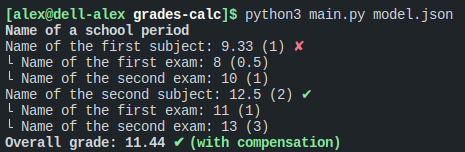

# Grades calc

A python script which sums school grades up, and calculates subject and overall grades.

## How to use it ?

You have to create a JSON file and write your data into it by following `model.json`.  
Finally, type `python3 main.py data.json` in a terminal, assuming `data.json` is your JSON file.

## Expected output with `model.json`

